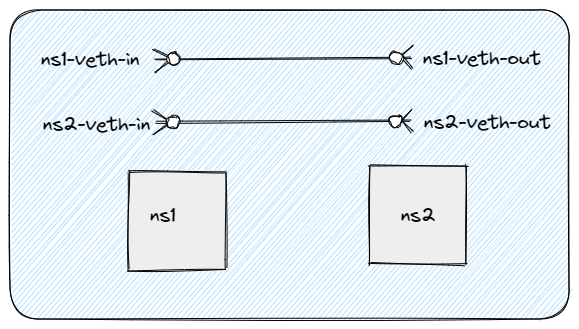
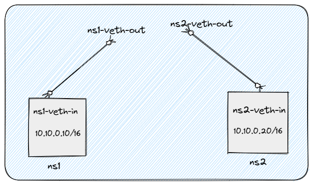
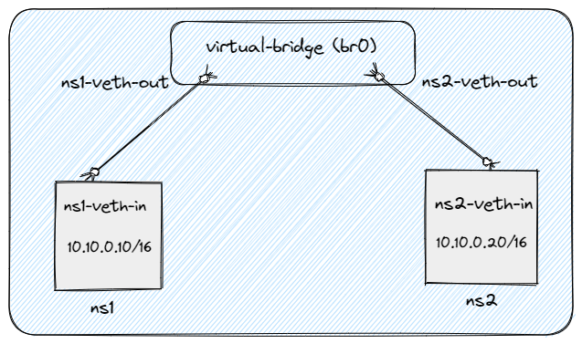

# Communication between multiple namespaces via virtual bridge
=====================================================================

## Introduction
------------

This documentation provides a step-by-step guide to creating and configuring virtual network elements using namespaces, virtual Ethernet cables, and a virtual bridge in order to establish communication between two namespaces.

## Prerequisites
-------------

Before proceeding with the setup, ensure that the following prerequisites are met:

*   Basic knowledge of Linux networking and terminal commands.
*   Vagrant, Git and VirtualBox are installed on your machine.


### Step 1: Install VirtualBox and Vagrant
- Download and Install VirtualBox from the official website (https://www.virtualbox.org)

- Download and Install Vagrant from the official website (https://www.vagrantup.com/)

## Step 2: Initialize an Ubuntu Box in Vagrant
- Open your git bash terminal

- Create a new directory for your virtual environment mkdir ubuntu-vm

- Change to the newly created directory cd ubuntu-vm

- Initialize a new Vagrant Box with Ubuntu: vagrant init ubuntu/bionic64

## Step 3: Bring Up the Vagrant Box and SSH into It
- Start the Vagrant box: 

    ```bash
    vagrant up 
    ```
This process may take a few minutes.

- SSH into the running Vagrant box: 

    ```bash
    vagrant ssh
    ``` 
This will give you access to the Ubuntu environment within the virtual machine.

## Step 4: Create Namespaces
-------------------------

- Open a terminal or shell prompt on your Linux system.
    
- Create the first namespace using the following command: 
    
    ```bash
    sudo ip netns add ns1
    ```
    
- Create the second namespace using the same command:
    
    ```bash
    sudo ip netns add ns2
    ```
    

## Step 5: Create Virtual Ethernet Cables
--------------------------------------

-  Create the first virtual Ethernet cable connecting ns1 and the virtual bridge:
    
    ```bash
    sudo ip link add ns1-veth-in type veth peer name ns1-veth-out
    ```
   
-  Create the second virtual Ethernet cable connecting namespace2 and the virtual bridge:
    
    ```bash
    sudo ip link add ns2-veth-in type veth peer name ns2-veth-out
    ```

    


-  Move the ns1-veth-in end of the cable into ns1:

    ```bash
    sudo ip link set ns1-veth-in netns ns1
    ```

-  Move the ns2-veth-in end of the cable into ns2:
    
    ```bash
    sudo ip link set ns2-veth-in netns ns2
    ```
    
    


## Step 6: Assign IP Addresses
---------------------------

-  Assign an IP address to the ns1-veth-in interface within ns1:
    
    ```bash
    sudo ip netns exec ns1 ip addr add 10.10.0.10/16 dev ns1-veth-in
    ```
    
-  Assign an IP address to the ns2-veth-in interface within ns2:
    
    ```bash
    sudo ip netns exec ns2 ip addr add 10.10.0.20/16 dev ns2-veth-in
    ```
    

## Step 7: Create Virtual Bridge
-----------------------------

-  Create the virtual bridge:
    
    ```bash
    sudo ip link add br0 type bridge
    ```
    
-  Activate the virtual devices:
    
    ```bash
    sudo ip link set br0 up
    sudo ip link set ns1-veth-out up
    sudo ip link set ns2-veth-out up
    sudo ip netns exec ns1 ip link set dev lo up
    sudo ip netns exec ns1 ip link set dev ns1-veth-in up
    sudo ip netns exec ns2 ip link set dev lo up
    sudo ip netns exec ns2 ip link set dev ns2-veth-in up
    ```
    
-  Connect the ns1-veth-out interface to the virtual bridge:
    
    ```bash
    sudo ip link set ns1-veth-out master br0
    ```
    
-  Connect the ns2-veth-out interface to the virtual bridge:
    
    ```bash
    sudo ip link set ns2-veth-out master br0
    ```
    
  

    

## Step 8: Testing Communication
-----------------------------

-  Open two terminal windows, one for each namespace.
    
-  In the first terminal, enter the ns1:
    
    ```bash
    sudo ip netns exec ns1 bash
    ```
    
-  In the second terminal, enter the ns2:
    
    ```bash
    sudo ip netns exec ns2 bash
    ```
    
-  Ping the IP address of the opposite namespace from each terminal to test communication:
    
    In the ns1 terminal:
    
    `ping 10.10.0.20`
    
    In the ns2 terminal:
    
    `ping 10.10.0.10`
    
    Note that, we didn't add any default route here but still its working cause bridge is involved here. By checking route inside the namespaces, we can see route already added.

    ```bash
    sudo ip netns exec ns1 ip route
    ```
    

## Conclusion
----------

 We have successfully created two namespaces, established virtual Ethernet cables, created a virtual bridge, and enabled communication between the namespaces. You can now use this setup for various networking experiments and configurations.

